<h3><code>arpita@github ~ $ whoami</code></h3>

 
 

<!-- animated contribution graph: real data, boxes reveal cell by cell
     (regenerated daily by .github/workflows/update-profile-art.yml) -->

<h3><code>arpita@github ~ $ ./contributions.sh</code></h3>

 
 

<h3><code>arpita@github ~ $ ./skills_and_links.sh</code></h3>

<b>Full Stack Developer · MERN & Angular Specialist · Web Application Builder</b>

 

#### ⚡ Tech Stack & Core Competencies

 

